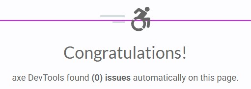

# WCAGAngularMaterial

This project is aimed to test and demonstrate getting some simple pages in a SPA to comply with WCAG 2.1AA standards for web accessibility.\
A demo of the site can be found [WCAG Angular material demonstration](https://ianoxwell.github.io/WCAGAngularMaterial/)

## Axe clean and lighthouse 100%

The aim is to produce a repeatable #axeClean in any state of the app with re-usable components between projects.

## WCAG resources

I prefer going straight to the source and using the w3 produced resources directly./
[How to Meet WCAG](https://www.w3.org/WAI/WCAG21/quickref/)
[Web Accessibility Tutorials](https://www.w3.org/WAI/tutorials/)

## Deploy

Run `ng deploy --base-href=WCAGAngularMaterial` to build the project. The build artifacts will be stored in the `dist/` directory. Use the `--prod` flag for a production build.

## Running unit tests and lint

Run `ng test` to execute the unit tests via [Karma](https://karma-runner.github.io).

The project has been set up with eslint as the linter.\
Run `ng lint` to execute including eslint/prettier.
